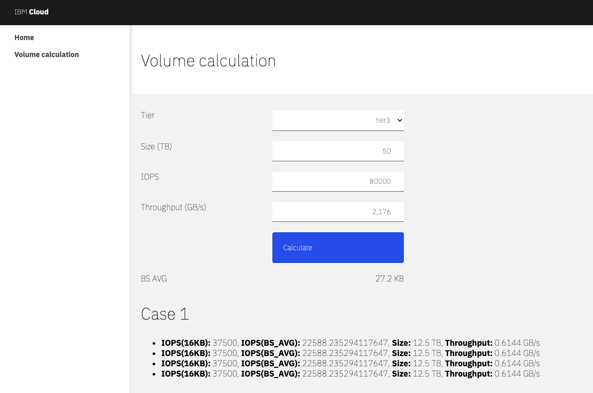

> [!WARNING]
> IBM Legacy Public Repository Disclosure: All content in this repository including code has been provided by IBM under the associated open source software license and IBM is under no obligation to provide enhancements, updates, or support. IBM developers produced this code as an open source project (not as an IBM product), and IBM makes no assertions as to the level of quality nor security, and will not be maintaining this code going forward

# Introduction
This repository aims to implement the analytical method described in **TODO: ADD BLOG URL** for calculating the optimal configuration of block storage disks on a virtual machine within a VPC, to comply with given parameters of storage size, IOPS, and throughput. We will focus on custom block storage and tiers 3,5,10. Therefore, this repo will provide a python and angular application in this regard.

> [!Important]
> The proposed implementation are not officially endorsed by IBM. This is merely an analytical approach intended to assist in calculating block storage volumes. Consider it a starting point that should be adapted to your specific needs. In fact, slightly overprovisioning IOPS, size, or throughput in production environments may be a good practice—but doing so is entirely at your own discretion and responsibility.

# Deploy the backend on your local environment
The backend has been developed in Python using the Flask framework. Create a virtual environment and install the dependencies.
```bash
cd api
virtualenv -p python3 venv
source venv/bin/activate
pip install -r requirements.txt
cd src
```
Run it
```bash
python3 main.py
```
Test it executing
```bash
curl -X POST localhost:5000/volumes \
-H "Content-type:application/json" \
-d '{"thoughput": 0.670, "iops": 48000, "size": 16, "tier": "tier3"}'
```
* Throughput is expressed in ```GB/s```
* Size is expressed in ```TB```
* Tier — possible values are:
    * tier3
    * tier5
    * tier10
    * custom

# Deploy the frontend on your local environment
Install node 18 and angular globally
```bash
nvm install 18
npm install -g @angular/cli
```
Install node modules
```bash
cd front
npm install
```
Run it
```bash
ng serve -c local
```
Open ```http://localhost:4200``` in a browser




# Utils
### How to install nvm on macOS/Linux
```bash
curl -o- https://raw.githubusercontent.com/nvm-sh/nvm/v0.40.3/install.sh | bash
```
More info here https://github.com/nvm-sh/nvm?tab=readme-ov-file#installing-and-updating

# References
* https://angular.dev/
* https://flask.palletsprojects.com/en/stable/
* https://cloud.ibm.com/docs/vpc?topic=vpc-block-storage-profiles&interface=ui
* https://github.com/nvm-sh/nvm?tab=readme-ov-file#installing-and-updating